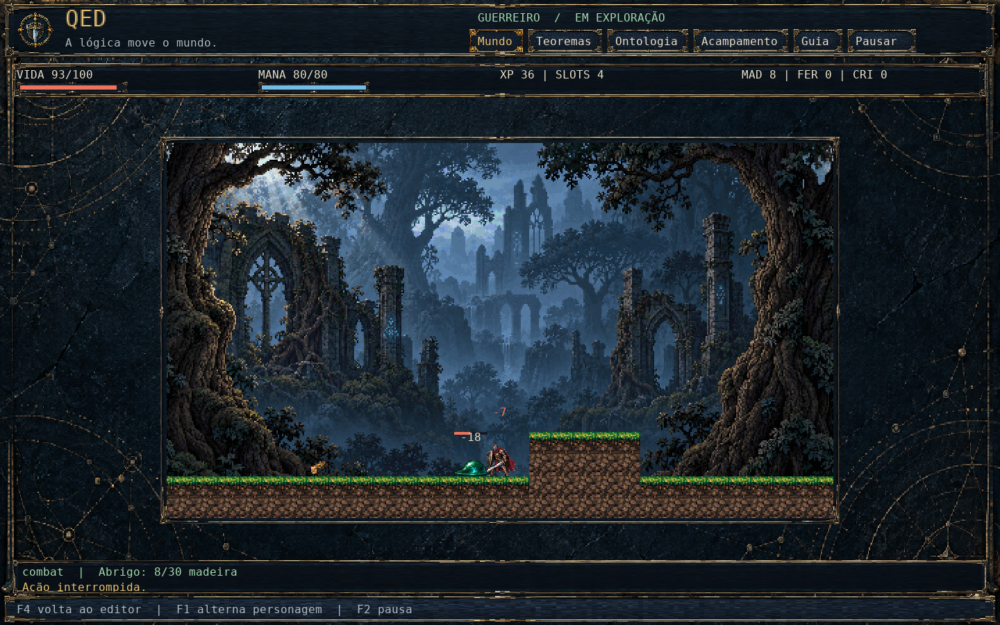
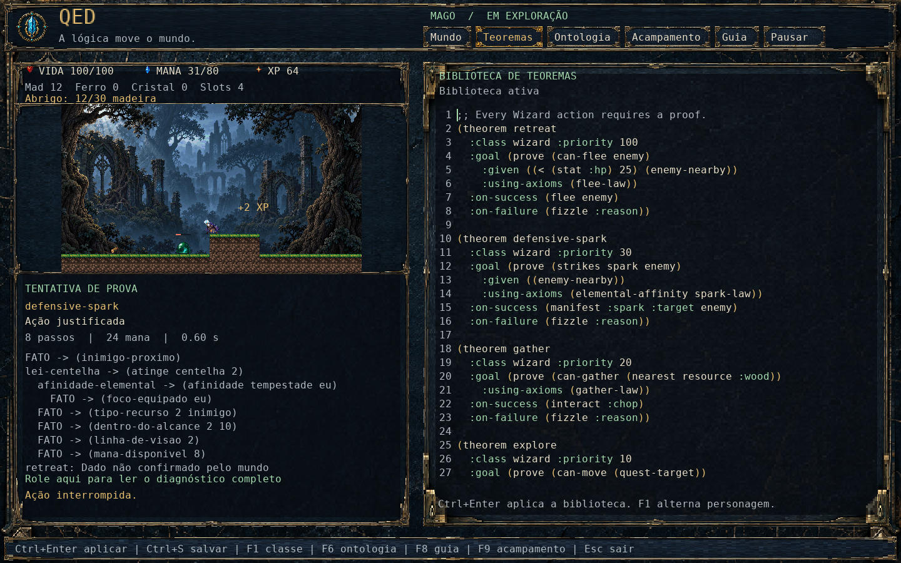
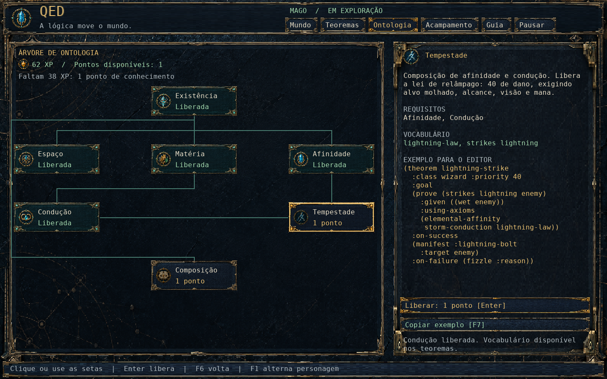
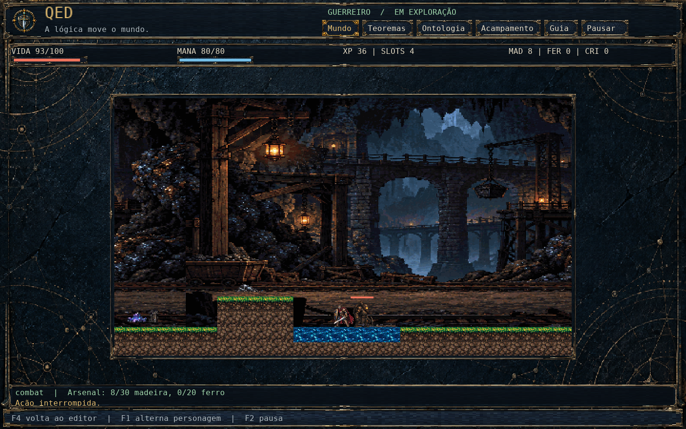
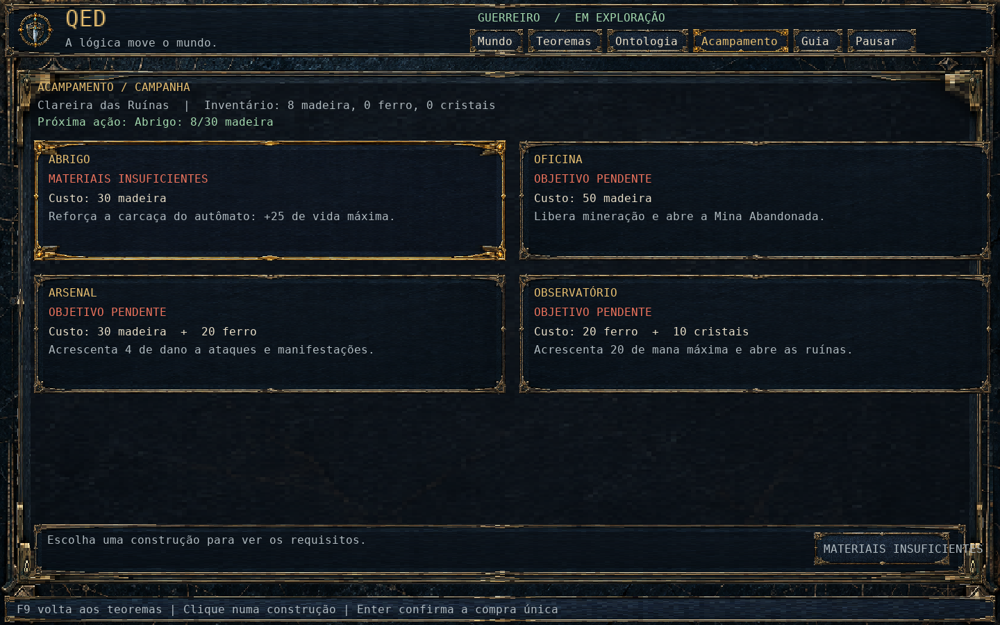
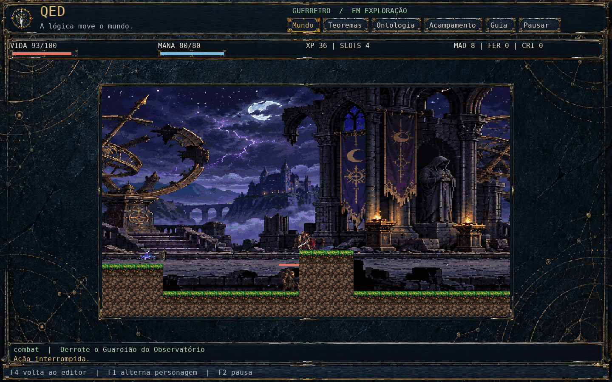

<div align="center">

# QED

**Escreva a lógica. Observe a aventura.**

Um RPG incremental de fantasia arcana, em pixel art, onde cada ação precisa de uma justificativa.

**Linux · Um jogador · Campanha jogável de 30–60 minutos por personagem**

[Jogar](#jogar-no-linux) · [Como funciona](#a-lógica-é-seu-controle) · [Ontologia](#conhecimento-muda-o-que-é-possível) · [Documentação](#por-dentro-do-grimório)

</div>



Da Clareira das Ruínas às profundezas da Mina Abandonada e ao Observatório,
seus autômatos recolhem materiais, constroem o acampamento e enfrentam o
Guardião. Você escreve os teoremas que orientam suas decisões. Uma premissa
verdadeira pode justificar um golpe; uma prova pode dar forma a uma centelha.
Quando a lógica falha, o personagem espera — e o diagnóstico explica por quê.

## A lógica é seu controle

**Guerreiro — decida pelas circunstâncias.** Organize regras por prioridade:
fuja quando a vida estiver baixa, ataque uma ameaça próxima e recolha madeira
quando o caminho estiver livre. A primeira regra aplicável determina a ação.

**Mago — prove antes de agir.** Combine fatos do mundo e axiomas para justificar
deslocamento, coleta, fuga e magia. Acompanhe os passos da prova e seu custo de
mana. Um alvo molhado pode ser a peça que faltava para provar um relâmpago.
Sentinelas e o Guardião anunciam golpes, permitindo reagir à preparação e à
recuperação em regras e provas.

```lisp
(theorem combat
  :class fighter
  :priority 30
  :premises ((enemy-in-range :melee))
  :conclusion (attack :basic))
```

Os exemplos são escritos em inglês. O editor também aceita português e os dois
idiomas no mesmo documento. As bibliotecas
[do Guerreiro](exemplos/warrior.lisp) e [do Mago](exemplos/wizard.lisp)
já fazem os personagens agir; você pode experimentar aos poucos.
Uma edição inválida preserva a última biblioteca aplicada.



## Conhecimento muda o que é possível

A árvore de habilidades é uma **árvore de ontologia**. Cada área libera
conceitos que passam a funcionar nos seus teoremas.



| Caminho | O que você aprende |
|---|---|
| Guerreiro: **Estados** | Consultar propriedades mutáveis, como um alvo molhado. |
| Guerreiro: **Impacto** | Justificar o golpe pesado. |
| Mago: **Condução → Tempestade** | Relacionar umidade e condutividade para provar relâmpagos. |
| Ambos: **Composição** | Ampliar a biblioteca com um quinto espaço de teorema. |

Cada personagem ganha um ponto de conhecimento aos **30, 60 e 100 XP**.
Você escolhe onde gastá-lo. Os pontos de conhecimento continuam separados das
construções do acampamento.

Guerreiro e Mago mantêm progresso, bibliotecas e mapas separados. Só o ativo
avança. O jogo continua sem foco, salva ao fechar e não concede ganhos offline.

## Uma campanha em sete telas

O percurso é contínuo: três telas na Clareira, duas na Mina Abandonada e duas
nas Ruínas do Observatório. A Oficina abre a mina; o Observatório restaurado
abre as ruínas.



| Construção | Custo | Efeito permanente |
|---|---:|---|
| Abrigo | 30 madeira | +25 de vida máxima |
| Oficina | 50 madeira | Mineração e acesso à mina |
| Arsenal | 30 madeira + 20 ferro | +4 de dano |
| Observatório | 20 ferro + 10 cristais | +20 de mana máxima e acesso às ruínas |

As compras são únicas e atômicas. O HUD informa a próxima ação; a tela
**Acampamento** mostra custos, requisitos e o progresso da campanha.



Fatos como `(inventory :iron-ore)`, `(enemy-state enemy :windup)` e
`(quest-target)` conectam a campanha aos teoremas. O Guia oferece exemplos em
inglês para deslocamento, mineração e fuga. Copiar apenas envia o exemplo ao
clipboard; você decide onde colar e quando aplicar.



## Jogar no Linux

Você precisará de **SBCL, Quicklisp, LWLGL 2.2**, `cl-freetype2` e FiveAM,
além de GLFW, FreeType e um driver **OpenGL 3.3**. O LWLGL deve estar disponível
pelo ASDF, com seu módulo nativo STB compilado. Veja a
[preparação do ambiente](documentacao/DESENVOLVIMENTO.md).

Com as dependências preparadas:

```sh
git clone https://github.com/EdenCompiler/QED.git
cd QED
make compilar
./build/qed
```

Também é possível iniciar pelo código com `make executar`. O executável é uma
compilação local: mantenha a pasta do projeto e seus assets disponíveis.
Ainda não há pacote de distribuição independente. Janela recomendada: **1440×900**;
a interface também foi verificada em **1280×800**.

**Sua primeira experiência:** observe a biblioteca inicial, abra **Ontologia**
para conhecer os conceitos e use **Guia** para consultar exemplos. Volte a
**Teoremas**, faça uma alteração e pressione **Ctrl+Enter** para aplicá-la.
A pausa é manual, pelo botão **Pausar** ou por **F2**.

| Controle | Ação |
|---|---|
| Botões superiores | Mundo, Teoremas, Ontologia, Acampamento, Guia e pausa |
| `F1` | Alternar Guerreiro / Mago |
| `Ctrl+Enter` | Validar e aplicar a biblioteca |
| `Ctrl+S` | Salvar progresso e rascunhos |
| `F4` / `F6` / `F8` / `F9` | Mundo / Ontologia / Guia / Acampamento |
| Setas e `Enter` na árvore | Selecionar uma área e desbloqueá-la |
| `F7` na árvore ou no guia | Copiar o exemplo para o clipboard |
| `Esc` | Salvar e sair |

<details>
<summary>Mais controles e arquivos de partida</summary>

O editor suporta seleção com mouse e Shift, copiar/recortar/colar,
`Ctrl+Z` para desfazer e `Ctrl+Y` para refazer. A roda percorre o painel sob o
cursor. `F3` alterna o idioma dos diagnósticos; `F5` recarrega os assets.

Sua partida fica em `~/.local/share/qed/partida.sexp`, ou em
`$XDG_DATA_HOME/qed/partida.sexp`, com backup. Para experimentar uma sessão nova
sem ler nem gravar seu progresso, use `./build/qed --sem-salvar`.

</details>

## Por dentro do grimório

Esta versão contém sete telas conectadas, três regiões, campanha, chefe,
construções, mineração, combate anunciado, coleta, saltos automáticos, morte e
reaparecimento, duas classes, editor e progressão por escolhas. Classes
adicionais, equipamentos individuais, consumíveis, multiplayer e ganhos offline
ficam fora desta versão.

O jogo é escrito em **Common Lisp**, com código e documentação em português
brasileiro. A simulação funciona independentemente da renderização.

- [Linguagem dos teoremas](documentacao/DSL.md)
- [Compilar, testar e contribuir](documentacao/DESENVOLVIMENTO.md)
- [Interface: referências e decisões aplicadas](documentacao/UI.md)
- [Arte e projetos editáveis](art-source/README.md)
- [Arquitetura](documentacao/ARQUITETURA.md) · [Validação e limites conhecidos](documentacao/VALIDACAO.md)

Os sprites e os assets da interface usam imagens geradas por IA, preparadas e
exportadas no Aseprite. Os originais, projetos editáveis e
[prompts da interface](art-source/interface/PROMPTS.md) e
[prompts da campanha](art-source/referencias/PROMPTS-CAMPANHA.md) acompanham o repositório.
As imagens deste README são capturas do jogo em execução.
